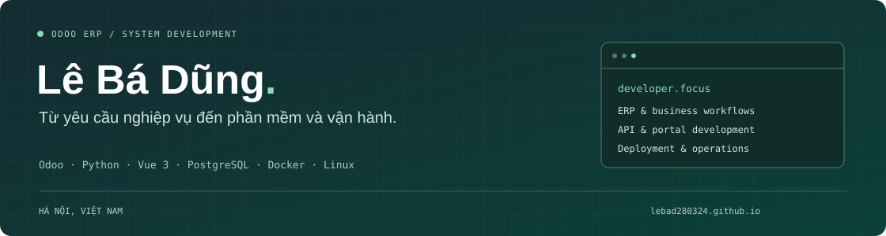

  

  
  &nbsp;
  

## Xin chào, tôi là Dũng

Tôi phát triển và tùy chỉnh **Odoo ERP**, xây dựng **portal Vue** và triển khai ứng dụng trên **Linux/Docker**. Hiện tôi là **Chuyên viên phát triển hệ thống tại An Phát**, tham gia từ tìm hiểu yêu cầu, thiết kế dữ liệu đến phát triển, kiểm thử và hỗ trợ vận hành.

Tôi quan tâm đến các giải pháp giúp phòng ban làm việc trên một hệ thống chung, với luồng xử lý rõ ràng và dữ liệu được kiểm soát theo quyền truy cập.

## Công nghệ tôi làm việc cùng

| Lĩnh vực | Công nghệ và công việc |
| --- | --- |
| **Odoo ERP** | Odoo 16–19, ORM, kế thừa, XML/QWeb, OWL, ACL và record rules |
| **Backend và tích hợp** | Python, FastAPI, REST API, PostgreSQL, MySQL |
| **Giao diện portal** | Vue 3, TypeScript, Pinia, Vite, HTML/CSS |
| **Triển khai và vận hành** | Docker Compose, Linux/Ubuntu, Nginx, Git/GitLab, SSH |
| **Kiểm thử** | Vitest, kiểm tra TypeScript, kiểm thử API và nghiệp vụ Odoo |

## Dự án ERP nội bộ tại An Phát

**Odoo 19 · PostgreSQL 16 · Vue 3/TypeScript · Docker Compose**

Các phân hệ tôi tham gia phát triển:

- **Booking và tài nguyên** — đặt phòng họp, điều phối xe công vụ, phê duyệt và kiểm soát xung đột lịch.
- **Helpdesk IT** — tiếp nhận yêu cầu, quản lý SLA, Kanban, hỗ trợ từ xa và thông báo qua Telegram.
- **E-Learning** — khóa học, nội dung, tiến độ học viên, kiểm tra và chứng chỉ nội bộ.
- **Thiết bị và tài sản** — hồ sơ thiết bị, cấu hình, cấp phát, bảo trì và bàn giao.
- **Tài liệu Nextcloud** — kết nối WebDAV, tải tệp và quản lý truy cập từ portal.
- **An Phát Connect** — bảng tin, thông báo, lượt thích và bình luận theo công ty.

Tôi cũng làm việc với phân quyền công ty/chi nhánh, đăng nhập 2FA/TOTP, CSRF, quản lý phiên bản ứng dụng, script sao lưu và xử lý sự cố API, HTTPS, WebSocket.

<b>Xem kinh nghiệm trước đây</b>

### Wsoftpro · 02/2025–09/2025

Phát triển CRM nội bộ trên Odoo 18; tùy chỉnh CRM, Dự án, Tuyển dụng và Liên hệ. Tích hợp Gmail hai chiều, hỗ trợ xử lý email và liên kết lead CRM với hồ sơ ứng viên.

### VDX Digital Transformation Solutions · 08/2024–02/2025

Nghiên cứu và phát triển nền tảng Odoo với model, view, action, menu, ORM và cơ chế kế thừa; xử lý trường tính toán, ràng buộc và onchange trong nghiệp vụ.

## Nghiên cứu và định hướng

**AI tại An Phát đang ở mức thử nghiệm, chưa đưa vào vận hành thực tế.** Tôi nghiên cứu chatbot tra cứu tài liệu bằng FastAPI/Ollama và các workflow n8n để đánh giá khả năng hỗ trợ quy trình nội bộ.

Các hướng đang hoạch định gồm sao lưu và khôi phục dữ liệu, tách database khỏi máy ứng dụng, chuẩn bị máy dự phòng, chuẩn hóa CI/CD và tách API công khai khỏi API ERP nội bộ. Đây là **các phương án nghiên cứu hoặc đề xuất**, chưa được ghi nhận là kết quả triển khai hoàn tất.

## Cách tôi làm việc

**Tìm hiểu nghiệp vụ → Thiết kế giải pháp → Phát triển → Kiểm thử → Triển khai → Hỗ trợ và cải tiến.**

Tôi ưu tiên làm rõ yêu cầu, tìm nguyên nhân lỗi, kiểm tra tác động của thay đổi và ghi nhận phản hồi của người dùng sau triển khai.

## Kết nối với tôi

- **CV và portfolio:** [lebad280324.github.io](https://lebad280324.github.io/)
- **Email:** [lebadung561@gmail.com](mailto:lebadung561@gmail.com)
- **LinkedIn:** [Lê Bá Dũng](https://www.linkedin.com/in/d%C5%A9ng-l%C3%AA-b%C3%A1-78911a270/)
- **Địa điểm:** Hà Nội, Việt Nam

---

Odoo ERP · Phát triển hệ thống · Tích hợp API · Triển khai và vận hành

